# Auto Insurance Claims Analytics using MySQL

## Project Overview

This project analyzes an **Auto Insurance Claims** dataset using **MySQL** to uncover insights related to customer demographics, insurance policies, premium distribution, claim patterns, and fraud detection.

The project follows a structured analytics workflow beginning with **data exploration and quality assessment**, followed by **customer profiling, premium analysis, claims analysis, fraud investigation, and advanced SQL techniques** to generate meaningful business insights.

This project demonstrates practical SQL skills commonly used by **Data Analysts** and serves as the SQL foundation for a future **Power BI dashboard**.

---

# Dataset Information

The dataset contains information about:

- Customer demographics
- Insurance policy details
- Annual premium information
- Vehicle information
- Insurance claim records
- Accident details
- Fraud reporting status

**Total Records Analyzed:** **1,000**

---

# Objectives

- Understand the demographic profile of policyholders.
- Analyze premium distribution across different customer segments.
- Study insurance claim patterns.
- Identify fraud trends within claims.
- Generate business insights using SQL.
- Build a clean analytical foundation for Power BI reporting.

---

# Database

**Database:** `insurance_analytics`

**Table Used:**

- `autoclaims_cleaned`

The raw dataset was first cleaned in Microsoft Excel by removing unnecessary attributes before being imported into MySQL for analysis.

---

# SQL Concepts Covered

This project demonstrates the use of:

- SELECT
- WHERE
- ORDER BY
- LIMIT
- Aggregate Functions (COUNT, SUM, AVG, MIN, MAX)
- GROUP BY
- HAVING
- CASE Statements
- Subqueries
- Correlated Subqueries
- Common Table Expressions (CTEs)
- Views
- Stored Procedures
- Triggers

---

# Analysis Performed

## 1. Data Understanding

- Total records
- Duplicate policy check
- Missing value inspection
- Age statistics
- Incident type exploration

---

## 2. Customer Demographic Analysis

- Gender distribution
- Occupation distribution
- Customer age segmentation
- Policy distribution by state

---

## 3. Policy & Premium Analysis

- Premium statistics
- Top premium-paying policyholders
- Premium distribution across customer segments
- Premium category analysis
- Deductible analysis
- Coverage (CSL) analysis

---

## 4. Claims Analysis

- Claim statistics
- Highest claim amounts
- Claims by occupation
- Claims by incident severity
- Claims by age group

---

## 5. Fraud Analysis

- Fraud distribution
- Fraud percentage
- Fraud by incident type
- Fraud by incident severity
- Fraud vs. claim amount comparison

---

# Key Business Insights

## 1. Balanced Gender Distribution

The dataset contains **537 female** and **463 male** policyholders, providing a fairly balanced customer base for analysis.

---

## 2. Middle-Aged Customers Dominate the Portfolio

The majority of policyholders belong to the **30–50 years** age group (**731 customers**), indicating that middle-aged customers form the insurer's primary customer segment.

---

## 3. Premium Distribution is Concentrated in the Medium Range

The average annual premium is **1256.41**, with:

- Medium Premium Policies: **693**
- High Premium Policies: **154**
- Low Premium Policies: **153**

This suggests that most policyholders fall within a moderate premium range.

---

## 4. Claim Amounts Show Significant Variation

- Minimum Claim Amount: **100**
- Maximum Claim Amount: **114,920**
- Average Claim Amount: **52,761.94**

This highlights the wide variability in claim costs handled by the insurer.

---

## 5. Approximately One in Four Claims is Fraudulent

Fraud analysis revealed:

- Fraudulent Claims: **247 (24.70%)**
- Genuine Claims: **753 (75.30%)**

This indicates that fraud detection is an important aspect of insurance claim assessment.

---

## 6. Senior Customers Generate the Highest Average Claims

Using a **Common Table Expression (CTE)**, the average claim amount by age category showed:

- Senior: **58,848.86**
- Middle Age: **51,980.90**
- Young: **51,968.58**

Senior policyholders generated the highest average claim amounts among all customer groups.

---

# Dataset Overview

## Total Records

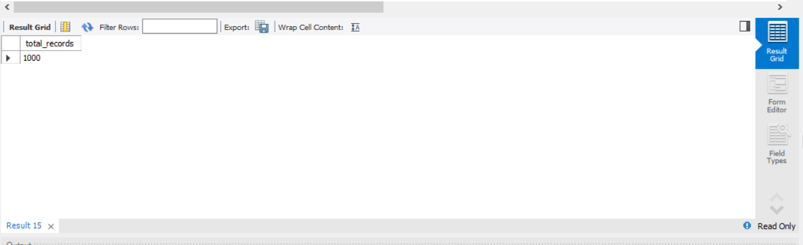

---

## Gender Distribution

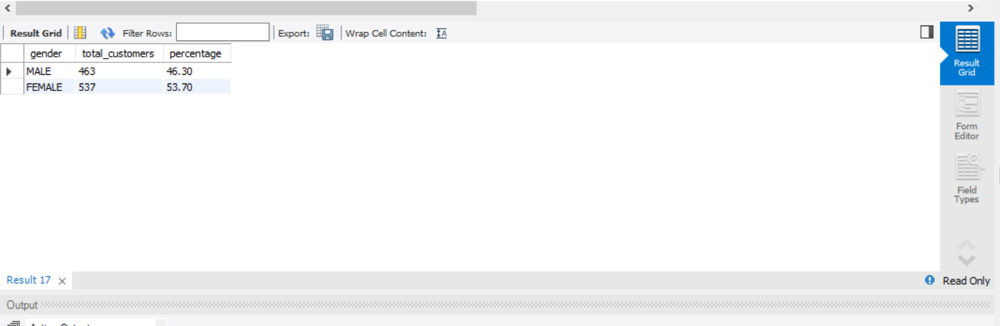

---

## Occupation Distribution

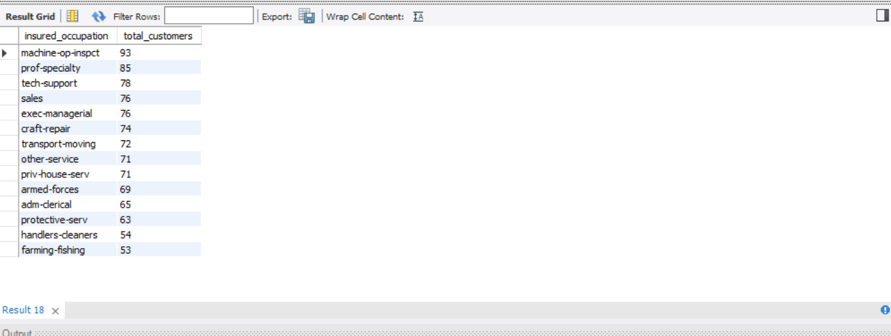

---

## Policy Distribution by State

The dataset contains policyholders from three U.S. states:

- **OH – Ohio**
- **IL – Illinois**
- **IN – Indiana**

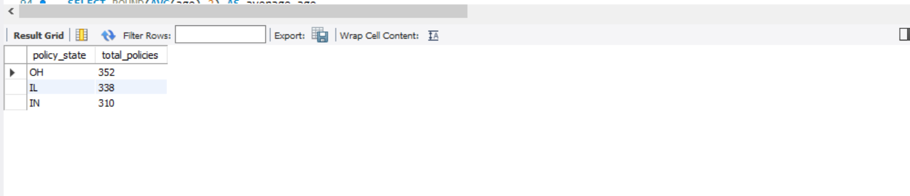

---

## Customer Age Groups

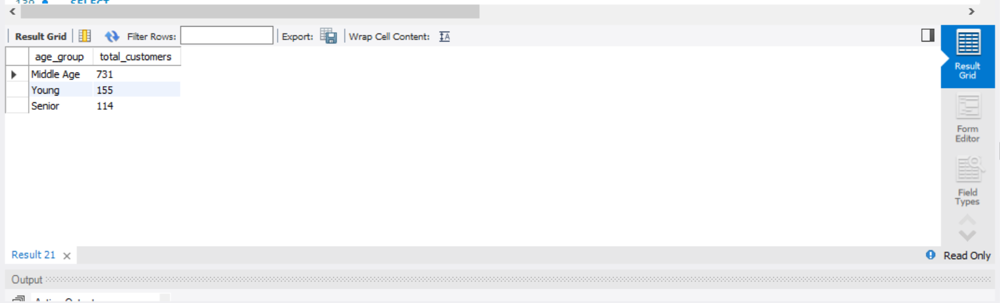

---

## Premium Statistics

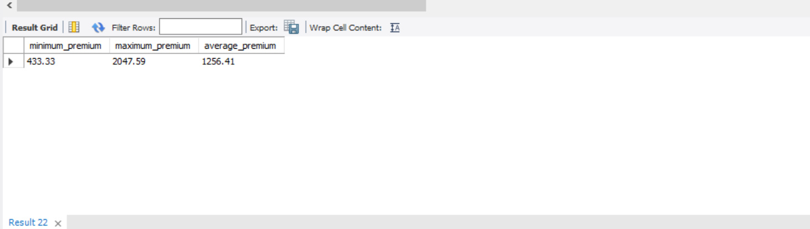

---

## Top Premium Policies

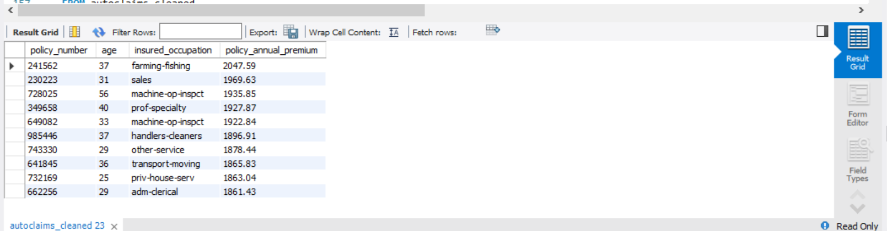

---

## Premium Categories

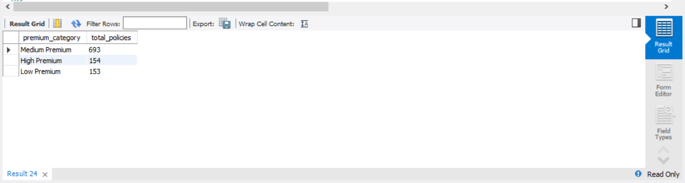

---

## Claim Statistics

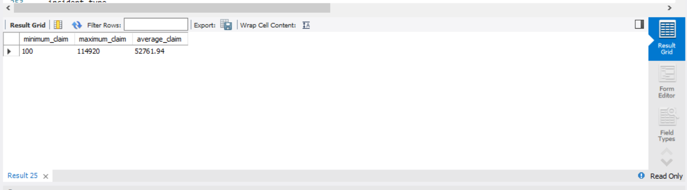

---

## Highest Insurance Claims

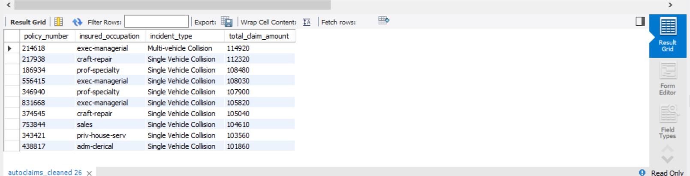

---

## Fraud Distribution

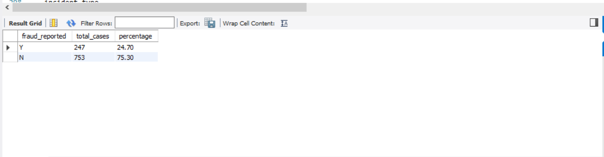

---

## Average Claim by Age Group (CTE)

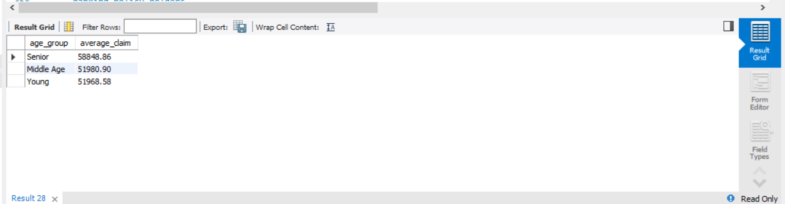

---

# Repository Structure

```
Auto-Insurance-Claims-Analytics-SQL/

│── Auto_Insurance_Analytics.sql
│── autoclaims_cleaned.csv
│── README.md
│
└── Screenshots/
```

---

# Tools Used

- MySQL
- MySQL Workbench
- Microsoft Excel

---

# Skills Demonstrated

- SQL Query Writing
- Data Cleaning
- Exploratory Data Analysis (EDA)
- Customer Segmentation
- Insurance Claims Analysis
- Fraud Detection
- Business Analytics
- Aggregate Functions
- CASE Statements
- Common Table Expressions (CTEs)
- Views
- Stored Procedures
- Triggers

---

# Next Phase

This SQL project serves as the analytical foundation for an **interactive Power BI dashboard**, where key business metrics such as customer demographics, premium trends, claim analysis, and fraud insights will be visualized using KPIs, charts, and interactive filters.

---

# Author

**Ronik Matta**

Actuarial Science Student 
